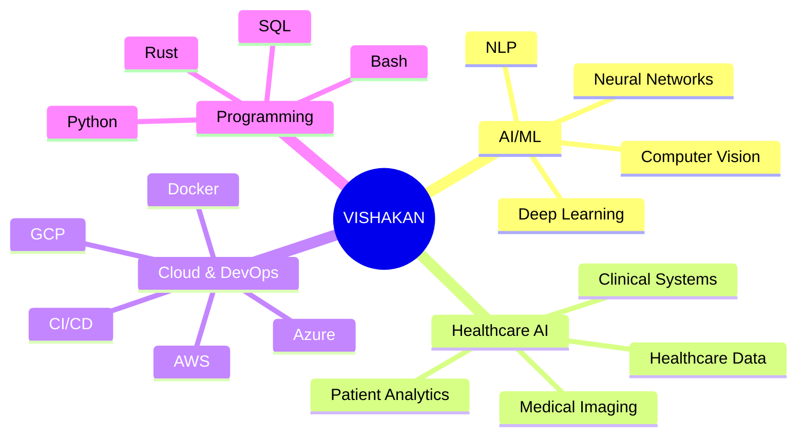

<!-- Header with Glitch Effect -->
<p align="center">
  
</p>

<!-- Animated Typing Title -->
<h1 align="center">
  
</h1>

<!-- Futuristic Divider -->
<p align="center">
  
</p>

<!-- Snake eating my contribution graph -->
<p align="center">
  
</p>

<!-- Futuristic Stats Cards -->
<div align="center">

  

  

</div>

<!-- Advanced Metrics -->
<div align="center">
  

  
</div>

<!-- 3D Profile Views Counter -->
<p align="center">
  
  
  
</p>

<!-- Futuristic Divider -->
<p align="center">
  
</p>

<!-- About Me Section with Terminal Style -->
<details open>
<summary><h2>🎯 SYSTEM PROFILE</h2></summary>

```yaml
Name: Vishakan U S
Role: AI/ML Engineer
Location: Austin, Texas, USA 🇺🇸
Origin: India 🇮🇳
Specialization: Healthcare AI Solutions
Current_Learning: [ "Rust Framework 🦀", "Advanced ML Systems", "Cloud Architecture" ]
Mission: "Building intelligent systems that transform healthcare"
Status: ✅ Available for collaboration
```

### 🔥 CORE EXPERTISE



</details>

<!-- Tech Stack with Animations -->
<details open>
<summary><h2>⚡ TECHNOLOGY ARSENAL</h2></summary>

<div align="center">

### 🧠 AI/ML FRAMEWORKS
<p>
  
  
  
  
  
  
</p>

### 💻 LANGUAGES & FRAMEWORKS
<p>
  
  
  
</p>

### ☁️ CLOUD & INFRASTRUCTURE
<p>
  
  
  
</p>

### 🗄️ DATABASES & STORAGE
<p>
  
  
  
  
</p>

### 🛠️ TOOLS & PLATFORMS
<p>
  
  
  
</p>

### 🤖 LLMs & TRANSFORMERS
<p>
  
  
  
  
  
  
  
</p>

</div>

</details>

<!-- Futuristic Divider -->
<p align="center">
  
</p>

<!-- GitHub Trophies -->
<details open>
<summary><h2>🏆 ACHIEVEMENTS UNLOCKED</h2></summary>

<p align="center">
  
</p>

</details>

<!-- Contribution Graph -->
<details open>
<summary><h2>📊 CONTRIBUTION MATRIX</h2></summary>

<p align="center">
  
</p>

<div align="center">
  
</div>

</details>

<!-- Futuristic Divider -->
<p align="center">
  
</p>

<!-- Current Focus -->
<details open>
<summary><h2>🎯 CURRENT MISSION</h2></summary>

```python
#!/usr/bin/env python3
# -*- coding: utf-8 -*-

"""
╔══════════════════════════════════════════════════════════════╗
║           VISHAKAN U S - AI/ML ENGINEER v2.0                 ║
╚══════════════════════════════════════════════════════════════╝
"""

class VishakanUS:
    """
    An AI/ML Engineer specializing in Healthcare AI Solutions
    """

    def __init__(self):
        self.username = "ivishakan"
        self.role = "AI/ML Engineer"
        self.location = "Austin, Texas 🇺🇸"
        self.origin = "India 🇮🇳"

        self.current_learning = {
            "languages": ["Rust 🦀", "Advanced Python"],
            "technologies": ["Healthcare AI", "MLOps", "Cloud Architecture"],
            "focus_areas": ["Distributed Systems", "Real-time ML", "Edge AI"]
        }

        self.expertise = {
            "ai_ml": [
                "Deep Learning",
                "Neural Networks",
                "Computer Vision",
                "Natural Language Processing",
                "Reinforcement Learning"
            ],
            "healthcare": [
                "Clinical Decision Support Systems",
                "Medical Image Analysis",
                "Patient Data Analytics",
                "Healthcare Predictive Models"
            ],
            "engineering": [
                "MLOps & Model Deployment",
                "Scalable ML Pipelines",
                "Cloud Architecture (AWS/Azure/GCP)",
                "Distributed Computing"
            ]
        }

        self.certifications = [
            "AWS Certified Solutions Architect",
            "Azure AI Engineer Associate",
            "TensorFlow Developer Certificate"
        ]

    def get_daily_routine(self):
        return {
            "morning": ["☕ Coffee", "📚 Research Papers", "💪 Workout"],
            "work": ["💻 Code", "🤖 Train Models", "☁️ Deploy to Cloud"],
            "evening": ["🦀 Learn Rust", "🏗️ Build Projects", "🧠 Study Algorithms"],
            "night": ["📝 Write Docs", "🌟 Contribute to Open Source", "🎮 Relax"]
        }

    def say_hi(self):
        print(
            """
            ╔════════════════════════════════════════════════════════╗
            ║  👋 Hey there! Thanks for visiting my profile!         ║
            ║                                                        ║
            ║  🚀 I'm passionate about leveraging AI to solve        ║
            ║     real-world problems, especially in healthcare.    ║
            ║                                                        ║
            ║  💡 Let's collaborate and build something amazing!     ║
            ║                                                        ║
            ║  📫 Reach out - I'm always open to new opportunities! ║
            ╚════════════════════════════════════════════════════════╝
            """
        )

    def __repr__(self):
        return f"<AI/ML Engineer: {self.username} | Location: {self.location}>"


if __name__ == "__main__":
    vishakan = VishakanUS()
    vishakan.say_hi()

    print(f"\n🎯 Current Mission: {vishakan.current_learning}")
    print(f"\n💪 Expertise: {len(vishakan.expertise['ai_ml'])} AI/ML Skills Mastered")
    print(f"\n🌟 Status: Available for exciting projects!")
```

</details>

<!-- Futuristic Divider -->
<p align="center">
  
</p>

<!-- Connect Section with Neon Effect -->
<details open>
<summary><h2>🌐 CONNECT WITH ME</h2></summary>

<div align="center">

### 💬 Let's Build the Future Together

<p>
  <a href="https://www.linkedin.com/in/ivishakan/" target="_blank">
    
  </a>
  <a href="https://www.instagram.com/ivishakan/" target="_blank">
    
  </a>
  <a href="https://github.com/ivishakan" target="_blank">
    
  </a>
  <a href="mailto:your.email@example.com" target="_blank">
    
  </a>
  <a href="https://twitter.com/ivishakan" target="_blank">
    
  </a>
</p>

### 📈 GitHub Analytics

<p align="center">
  
</p>

</div>

</details>

<!-- Futuristic Divider -->
<p align="center">
  
</p>

<!-- Party Parrots Section -->
<details>
<summary><h2>🎉 PARTY PARROTS ZONE 🎉</h2></summary>

<div align="center">

### 🦜 Because Every Great Profile Needs Party Parrots! 🦜

<p>
  
  
  
  
  
  
  
  
  
  
  
  
  
  
  
  
  
  
  
  
  
  
  
  
  
  
  
  
  
  
  
</p>

</div>

</details>

<!-- Futuristic Divider -->
<p align="center">
  
</p>

<!-- Dev Quote -->
<div align="center">
  
</div>

<!-- Futuristic Divider -->
<p align="center">
  
</p>

<!-- Spotify Now Playing (Optional - you can connect your Spotify) -->
<div align="center">

### 🎵 Currently Vibing To

[](https://open.spotify.com/user/YOUR_SPOTIFY_ID)

</div>

<!-- Futuristic Divider -->
<p align="center">
  
</p>

<!-- Support Section -->
<div align="center">

### ☕ Support My Work

<p>If you like my work and want to support me, consider buying me a coffee!</p>

<a href="https://www.buymeacoffee.com/ivishakan" target="_blank">
  
</a>

</div>

<!-- Futuristic Divider -->
<p align="center">
  
</p>

<!-- Fun Facts -->
<details>
<summary><h2>⚡ FUN FACTS</h2></summary>

```typescript
const funFacts = {
  code: "☕ Coffee is my fuel, bugs are my challenges",
  learn: "📚 I read research papers like others read novels",
  create: "🚀 Building the future, one neural network at a time",
  motto: "💡 If it can be imagined, it can be coded",
  superpower: "🦸 Converting coffee into code at 3 AM",
  dream: "🌟 Making AI accessible and beneficial for healthcare",
  weekends: "🎮 Gaming | 🏃 Running | 🧘 Meditation | 💻 Side Projects"
};

console.log(funFacts);
```

</details>

<!-- Futuristic Divider -->
<p align="center">
  
</p>

<!-- Footer with Animated Text -->
<div align="center">

### 💫 "Building the Future, One Model at a Time" 💫

<p align="center">
  
</p>

---

<p>
  
  
  
</p>

**⭐ From [ivishakan](https://github.com/ivishakan) | 🚀 Transforming Healthcare with AI | 💡 Innovation Never Sleeps**

</div>

<!-- Footer Wave -->
<p align="center">
  
</p>

<!-- Matrix Rain Effect (Easter Egg) -->
<p align="center">
  
</p>
